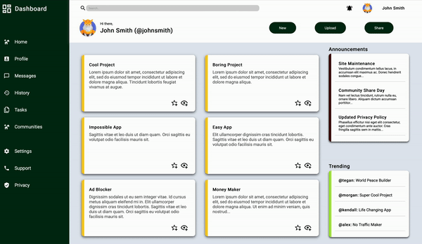

# fullstacklearning
A place to store all of the files used to practice HTML, CSS, JavaScript and anything full stack related! Using the [The Odin Project](https://www.theodinproject.com/) to learn HTML and CSS, and to create a basic website with features. 

## Project Overview
The aim is to create a functional website (of any context) using the knowledge gained from the tutorials, following good practices and examples. The purpose of this project is to expand my own knowledge in an area of development that I do not have much interaction with, but I am interested in.

- Odin Recipes: This is where the main files are stored. This includes index.html and style.css, and the recipe pages and images. The page is mainly to experiment with various features rather than be a fully-fledged website.
- practice: This contains projects undertaken through the Odin tutorials, utlising various elements learned throughout the lessons.

## Login page from scratch

## Project dashboard utlising all the lessons

## Technologies Used
- HTML
- CSS
Eventually this will include JavaScript and Bootstrap.

## Ideas for website
percentage of day/week/month/year passed (simple)
